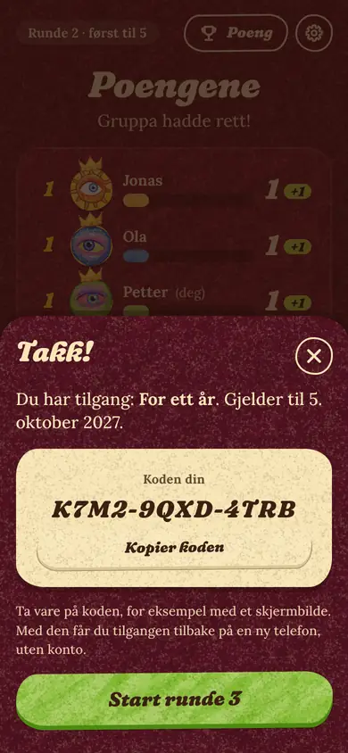

# Betaling: slik setter du opp Stripe og kobler det til Disputt

> Sist kontrollert mot dokumentasjonen til Stripe, Cloudflare og Skatteetaten: **4. oktober 2026**. Stripe og Cloudflare flytter på menyer og knapper av og til. Finner du ikke en knapp, bruk den direkte lenken som står ved steget, eller søk etter navnet i Dashboard. Dette er teknisk veiledning, ikke juridisk eller skattemessig rådgivning: det som handler om vilkår, angrerett, mva og personvern må du selv få sjekket av noen som kan det.

Innhold: [Kort fortalt](#kort-fortalt) · [1. Slik virker det](#1-slik-virker-det) · [2. Før du begynner](#2-før-du-begynner-virksomhet-skatt-og-jus) · [3. Stripe: konto](#3-stripe-konto-og-testmiljø) · [4. Pakkene](#4-stripe-pakkene-produkter-og-priser) · [5. Apple Pay og Vipps](#5-stripe-apple-pay-og-vipps) · [6. Informasjon og kvitteringer](#6-stripe-offentlig-informasjon-checkout-og-kvitteringer) · [7. Nøkler](#7-nøkler) · [8. Betalingsserveren](#8-betalingsserveren-cloudflare-worker) · [9. Koble til appen](#9-koble-til-appen-på-github) · [10. Test alt](#10-test-alt) · [11. Gå live](#11-gå-live) · [12. Drift](#12-drift) · [13. Slik henger koden sammen](#13-slik-henger-koden-sammen) · [14. Begrensninger](#14-begrensninger-og-mulige-neste-steg) · [15. Kilder](#15-kilder) · [Vedlegg: valgene i vilkår og personvern](#vedlegg-valgene-i-vilkår-og-personvern)

## Kort fortalt

**Det som er laget (i koden):** tre pakker, en betalingsmur etter to gratis runder, betaling med Vipps eller Apple Pay hos Stripe, ingen innlogging, og en kode som gir tilgangen tilbake på en ny telefon. **Alt er av som standard.** Uten to variabler på GitHub vises ingenting om betaling, og spillet er gratis, helt som i dag.

| Pakke | Pris | Varighet |
| --- | --- | --- |
| **En kveld** | 149 kr | 12 timer fra betalingen |
| **For ett år** (mest populær) | 399 kr | 12 måneder fra betalingen |
| **Livstid** (best verdi) | 499 kr | én betaling, ingen utløpsdato |

Alle er engangsbetalinger. Ingenting fornyes av seg selv. Bare **verten** betaler; de andre spiller gratis på sine egne telefoner.

<table>
<tr>
<td align="center"><br><sub>Verten trykker «Neste runde» etter runde 2 og får pakkene</sub></td>
<td align="center"><br><sub>Gjestene ser «Verten betaler» og venter</sub></td>
<td align="center"><br><sub>«Takk!» med koden, og én knapp som starter runde 3</sub></td>
<td align="center"><br><sub>«Allerede kunde? Logg inn» på forsiden</sub></td>
</tr>
</table>

**Det du må gjøre** (tidsbruk er et grovt anslag; ventetid hos andre kommer i tillegg):

| # | Hva | Hvor | Tid |
| --- | --- | --- | --- |
| 1 | Bekreft at Pesom Holding AS kan selge dette (formål, mva), sett opp e-posten kontakt@disputt.site, og få vilkårene lest av en som kan jus | Domeneshop, regnskapsfører, jurist ([del 2](#2-før-du-begynner-virksomhet-skatt-og-jus)) | dager; start først, kan gå parallelt med resten |
| 2 | Opprett Stripe-konto og bruk testmiljøet ([del 3](#3-stripe-konto-og-testmiljø)) | stripe.com | 30 min (identitetsbekreftelse kan ta dager) |
| 3 | **Be om Vipps-tilgang** ([del 5](#5-stripe-apple-pay-og-vipps)) | skjema hos Stripe | 5 min; ventetiden bestemmer Stripe. Gjør det med en gang. |
| 4 | Lag tre produkter med priser ([del 4](#4-stripe-pakkene-produkter-og-priser)) | Stripe | 15 min |
| 5 | Fyll ut offentlig informasjon og slå på kvitteringer ([del 6](#6-stripe-offentlig-informasjon-checkout-og-kvitteringer)) | Stripe | 20 min |
| 6 | Lag Stripe-nøkkel og signeringsnøkkel ([del 7](#7-nøkler)) | Stripe + Terminal | 15 min |
| 7 | Sett opp betalingsserveren ([del 8](#8-betalingsserveren-cloudflare-worker)) | Cloudflare | 30 min |
| 8 | Koble til appen i en test-kopi og test ([del 9](#9-koble-til-appen-på-github) og [10](#10-test-alt)) | GitHub + telefoner | 2–3 timer |
| 9 | Gå live ([del 11](#11-gå-live)) | alle | 1–2 timer |

**Det jeg har antatt** (si fra hvis noe skal være annerledes):

- Alle pakker er **engangskjøp**, ikke abonnement. Vipps hos Stripe støtter ikke abonnement (Checkout i abonnementsmodus), og «For ett år» fornyes derfor ikke av seg selv.
- Betalingsmuren er **myk**: spillmotoren kjører i vertens nettleser og koden er offentlig, så den som kan skrive kode kan fjerne den. Den stopper alle andre, men er ikke et kopibeskyttelsessystem ([del 14](#14-begrensninger-og-mulige-neste-steg)).
- «**Logg inn**» betyr å skrive inn koden du fikk da du betalte. Apple Pay er en betalingsmåte, ikke en innlogging, og «Logg inn med Vipps» krever en egen Vipps-avtale og et kunderegister ([del 14](#14-begrensninger-og-mulige-neste-steg)).
- Muren kommer når verten trykker «Neste runde» etter **runde to** (ikke midt i en runde).
- «En kveld» regnes som 12 timer fra betalingen.

## 1. Slik virker det

### Det verten opplever

1. De to første rundene i hvert spill er gratis.
2. Etter runde 2 trykker verten **Neste runde** og får **pakkene**. De andre spillerne ser det de alltid ser mellom runder: «Venter på at verten starter neste runde».
3. Verten velger pakke og trykker **Betal med Vipps** eller **Betal med Apple Pay**. Gjestene får beskjed om at verten betaler og venter.
4. Verten betaler på **Stripes betalingsside** og sendes tilbake til spillet, i samme fane.
5. **«Takk!»** viser tilgangen og en kode. Knappen **Start runde 3** fortsetter spillet. Gjestene kobler seg til igjen av seg selv.
6. Neste kveld ligger tilgangen på telefonen. På en ny telefon: **Allerede kunde? Logg inn**, og skriv koden.

### Tre deler

```
 Verten (nettleseren)                 Betalingsserveren                  Stripe
 (GitHub Pages)                       (Cloudflare Worker)
 ────────────────────                 ───────────────────                ──────
 «Neste runde» etter runde 2
 → pakkene
 «Betal med Vipps» ── POST /checkout ─▶ lager en betaling ───────────▶ Checkout Session
                  ◀── { url, session } ─┘
 sier «verten betaler» til gjestene
 går til Stripes side ──────────────────────────────────────────────▶ Vipps / Apple Pay / kort
                  ◀──────────── tilbake til spillet: ?pay=success&session_id=… ─┘
 ── GET /claim?session_id=… ──────────▶ spør Stripe: er den betalt? ──▶
                  ◀── { token, code } ──┘ signerer en tilgang
 tilgangen lagres på telefonen
 «Takk!» · «Start runde 3»
```

| Del | Gjør | Vet og lagrer |
| --- | --- | --- |
| **Telefonen** (appen på GitHub Pages) | viser pakkene, sender verten til Stripe, sjekker tilgangen | tilgangen og koden (`localStorage`), rommet og den pågående betalingen (`sessionStorage`) |
| **Betalingsserveren** (Cloudflare Worker, `payments/worker.js`) | starter betalingen hos Stripe, spør Stripe om den er betalt, signerer tilgangen, slår opp en kode | **ingenting**. Nøklene ligger som hemmeligheter i Cloudflare. Alt som trengs slås opp hos Stripe. |
| **Stripe** | tar imot betalingen, sender kvittering, er «kassen» | betalingen, e-posten kunden oppgir, pakken og koden (som metadata på betalingen) |

**Hvorfor en betalingsserver?** GitHub Pages kan bare vise filer. Stripe-nøkkelen kan aldri ligge i en side som alle kan lese, så noe «på innsiden» må snakke med Stripe. En Worker er det minste som går: én fil uten avhengigheter, ingen server å drive, og gratis opp til 100 000 kall om dagen.

**Tilgangen (passet)** er en signert tekst (JWT, ES256) som sier «dette er pakken `year`, betalt på tidspunkt T, gyldig til U». Betalingsserveren signerer den med en privat nøkkel som bare finnes i Cloudflare. Appen har den offentlige nøkkelen (den ligger åpent i `config.js`) og sjekker signaturen i nettleseren. Endrer noen pakke eller utløpsdato på sin telefon, blir signaturen ugyldig.

**Koden** (for eksempel `K7M2-9QXD-4TRB`) er tolv tegn (60 bit) som betalingsserveren lager når betalingen startes og som bare lagres hos Stripe, som metadata på betalingen. Den som kjenner koden kan få tilgangen på en ny telefon. Appen er snill med skrivemåten: små bokstaver, mellomrom og bindestreker spiller ingen rolle, og O, I og L regnes som 0, 1 og 1. Koden står på Stripes betalingsside (under betalingsknappen), vises på «Takk!» og under *Vertsvalg › Min tilgang*, og kan stå på kvitteringen hvis Stripe tar med beskrivelsen (se test 9 i [del 10](#10-test-alt)). Har kunden den ikke likevel, finner du den i Stripe ([del 12](#12-drift), «Mistet koden»).

**Når verten er hos Stripe.** Verten forlater siden mens han betaler. Rommet ligger lagret i fanen (`sessionStorage`) og kommer tilbake når Stripe sender verten hjem. Gjestene ville uten videre gitt opp etter ca. ett minutt, så verten sender dem først en melding (`away`) om at han er borte for å betale. Da venter de i opptil ti minutter med teksten «Verten betaler – spillet fortsetter straks». Vipps må godkjennes i appen innen fem minutter (Stripes regel), så ti minutter er romslig.

## 2. Før du begynner: virksomhet, skatt og jus

Dette er den delen som tar tid, og den du ikke kan hoppe over. Start i dag, og la resten av oppsettet gå parallelt.

### 2.1 Virksomhet og bankkonto

- **Selgeren er Pesom Holding AS**, org.nr. 923 729 674 MVA, Agathe Grøndahls gate 46, 0478 Oslo (opplysningene er hentet fra [Proff](https://www.proff.no/selskap/pesom-holding-as/oslo/designere/IF9YQDM009Y) 5. oktober 2026). Navn, org.nr. og adresse står på [vilkårssiden](../public/vilkar.html) og [personvernsiden](../public/personvern.html). Selskapet finnes allerede, så det er ingenting nytt å registrere.
- **Sjekk formålet først.** Proff oppgir selskapets formål som «Investeringsvirksomhet lukket for allmennheten». Å selge en spilltjeneste til forbrukere er noe annet. Spør regnskapsføreren om formålet i vedtektene og næringskoden i Enhetsregisteret bør oppdateres før dere tar imot betaling. Stripe ser på hva selskapet driver med når kontoen aktiveres, og det de finner (nettsiden, vilkårene, Enhetsregisteret) bør stemme overens.
- Stripe vil ha virksomhetstype (aksjeselskap), organisasjonsnummer, adresse, en representant som bekrefter identiteten sin (daglig leder), og en **norsk bankkonto i selskapets navn** (utbetalinger i NOK).
- Har du fast jobb: **les arbeidsavtalen** (bierverv, og hvem som eier det du lager på fritiden) før du begynner å selge noe. Selgeren er selskapet, men det er fortsatt du som lager spillet.

### 2.2 Merverdiavgift (mva)

- Pesom Holding AS står som **mva-registrert** (Proff viser «MVA» etter organisasjonsnummeret). Da skal prisene forbrukere ser være sluttprisene, med mva i. Appen og vilkårene sier derfor «inkl. mva»: 149, 399 og 499 kr er det kunden betaler, og selskapet skal beregne og betale mva av beløpet (normalsatsen er 25 %). Spør regnskapsføreren om riktig sats for denne typen tjeneste og om hvordan salg via Stripe skal bokføres.
- «inkl. mva» står i `public/js/screens/pay.js` og i punkt 2 i [vilkårene](../public/vilkar.html). Skulle selskapet likevel ikke være mva-registrert, må det ut begge steder.
- **Alternativ:** Stripe tilbyr [Managed Payments](https://docs.stripe.com/payments/managed-payments), der Stripe er selger overfor kunden (merchant of record) og tar mva-oppgjøret i over 80 land. Norge er med som forretningsland, og Apple Pay og kort støttes. Men **Vipps støttes ikke** (ikke i listen over betalingsmåter), kunden ser «Sold through Link», og kvitteringene kommer fra Link og kan ikke tilpasses. Det er ikke bygget inn her. Si fra hvis du vil vurdere det.

### 2.3 Vilkår, angrerett og personvern

De to sidene er laget og ligger i appen: [`public/vilkar.html`](../public/vilkar.html) og [`public/personvern.html`](../public/personvern.html), i appens stil. Når de er publisert, ligger de på `https://disputt.site/vilkar.html` og `https://disputt.site/personvern.html`. Betalingsskjermen i appen lenker til dem uten at du setter opp noe (`DISPUTT_TERMS_URL` og `DISPUTT_PRIVACY_URL` trengs bare om du vil bruke sider et annet sted). Selger og behandlingsansvarlig er Pesom Holding AS, med org.nr. og adresse øverst på begge sider. Valgene som er gjort i teksten står i [vedlegget](#vedlegg-valgene-i-vilkår-og-personvern).

- [x] **E-postadressen på sidene** er `kontakt@disputt.site` (lagt inn 5. oktober 2026, på fire steder: lenken og teksten i hver av de to filene). Den må virke før du går live, se [2.6](#26-e-post-på-disputtsite). Skal den byttes, bytt alle fire. Står `KONTAKT-EPOST` i sidene, stopper byggingen med betaling på.
- [ ] **Få vilkårene lest av en som kan jus**, med punktene i [vedlegget](#vedlegg-valgene-i-vilkår-og-personvern) og spørsmålet om bekreftelsen under.
- [ ] **Personvernerklæringen**: sjekk at den stemmer med det selskapet faktisk gjør. Bruker dere regnskapsprogram eller en e-posttjeneste som også behandler kundeopplysninger, skal de nevnes. Stripe krever en personvern-URL og støtte-e-post på kvitteringene.

**Angrerett.** Forbrukere har som hovedregel 14 dagers angrerett. For digitalt innhold og digitale tjenester som leveres med en gang faller den bort når leveringen er startet, **hvis kunden uttrykkelig har samtykket til at leveringen starter og bekreftet at angreretten da er borte**. Det holder ikke at det står i vilkårene: en avkrysningsboks ved betalingen er den tryggeste måten (se [veilederen om angrerett](https://cms12.regjeringen.no/contentassets/6d6b5195d1ee4133977bf5339d1623d9/veileder-angrerett-2017.pdf), angrerettloven § 22). Koden gjør dette for deg når du slår på `REQUIRE_TERMS` og `TERMS_URL` ([del 8](#8-betalingsserveren-cloudflare-worker)): på Stripes side står det da en boks som må krysses av: «Jeg godtar *vilkårene*, ber om at tilgangen leveres med en gang, og forstår at jeg da mister angreretten.» Få en som kan jus til å lese teksten før du går live.

**Bekreftelsen.** Etter det jeg finner, må kunden i tillegg få en bekreftelse på samtykket (og på at angreretten er borte) på e-post eller annet varig medium, ikke bare se boksen på betalingssiden. Stripes kvittering sier ikke noe om det i dag. Be juristen ta stilling til hvordan det løses: for eksempel at teksten legges i beskrivelsen som står på kvitteringen, eller at dere sender en egen bekreftelse. Stripe kan også lage en faktura for hver engangsbetaling i Checkout (`invoice_creation`, med egen tekst nederst og en PDF som kunden får på e-post), men det koster ekstra ([Stripe](https://docs.stripe.com/receipts#paid-invoice-receipts)) og er ikke bygget inn. Spør også regnskapsføreren om Stripes kvittering holder som salgsdokument for et mva-registrert selskap (org.nr. og mva-spesifikasjon), eller om dere trenger fakturaen. Si fra hva som blir konklusjonen, så bygger jeg inn det som trengs.

**Informasjonskapsler.** Appen bruker ingen sporing. Tilgangen og koden lagres i nettleseren fordi tjenesten trenger det, og Stripe har egne regler på sin side. Spør en jurist om du trenger et samtykkebanner (jeg tror ikke det).

### 2.4 Merkene til Apple og Vipps

Knappene i appen sier «Betal med Vipps» og «Betal med Apple Pay» som ren tekst, i appens egen stil. På Stripes side står de offisielle knappene. Før du går live: les retningslinjene for bruk av navn og merker ([Apple Pay](https://developer.apple.com/apple-pay/marketing/), [Vipps MobilePay](https://developer.vippsmobilepay.com/docs/brand/)) og vurder å bytte til de offisielle knappene, eller til en nøytral tekst.

### 2.5 Hva det koster

Stripe tar for norske og europeiske kort (Apple Pay regnes som kort) **2,4 % + 2 kr** per betaling, og 3,25 % + 2 kr for utenlandske kort ([Stripes prisside for Norge](https://stripe.com/en-no/pricing)). Vipps er et kortgebyr hos Stripe pluss et eget Vipps-gebyr som Stripe fakturerer én gang om dagen; størrelsen står ikke i dokumentasjonen, og du får den når du får tilgang. En tvist (chargeback) koster 200 kr. Cloudflare og GitHub Pages er gratis for dette bruket.

| Pakke | Pris | Stripe-gebyr | Igjen før mva og skatt | Hvis 25 % mva ligger i prisen: mva | Igjen etter gebyr og mva |
| --- | --- | --- | --- | --- | --- |
| En kveld | 149 kr | 5,58 kr | 143,42 kr | 29,80 kr | 113,62 kr |
| For ett år | 399 kr | 11,58 kr | 387,42 kr | 79,80 kr | 307,62 kr |
| Livstid | 499 kr | 13,98 kr | 485,02 kr | 99,80 kr | 385,22 kr |

(Regnestykket er et anslag for norske kort og Apple Pay. Vipps-gebyret er ikke med.)

### 2.6 E-post på disputt.site

Kundene skal skrive til `kontakt@disputt.site`: den står i vilkårene og personvernerklæringen, og skal også være støtte-e-post hos Stripe, som viser den på kvitteringene. Domenet `disputt.site` ble registrert hos Domeneshop 4. oktober 2026, men har ennå ikke e-post: DNS-oppsettet (`MX 0 .` og `v=spf1 -all`) sier at ingen tar imot post til domenet. **Post til adressen forsvinner derfor til du har satt den opp.**

- [ ] Logg inn hos Domeneshop (<https://www.domeneshop.no/login>) → **Mine domener** → `disputt.site` → **Epost**. E-post er en egen tjeneste hos Domeneshop som ikke følger med DNS-pakken ([Domeneshop](https://www.domeneshop.no/faq?id=40)): bestill den hvis den ikke er på, og se prisen der.
- [ ] **Opprett ny e-postadresse** `kontakt`, og la den **videresendes** til en adresse du leser.
- [ ] **Test:** send en e-post til `kontakt@disputt.site` fra en annen adresse enn den den videresendes til, og se at den kommer fram (sjekk søppelposten). Kommer den ikke: `dig +short MX disputt.site` i Terminal skal vise Domeneshops postservere, ikke bare `0 .`. Endringer i DNS kan ta opptil 24–48 timer å spre seg ([Domeneshop](https://help.domeneshop.no/nb/articles/588777-problemer-med-a-motta-e-post)).
- [ ] Vil du **svare** fra adressen, ikke bare lese? Lag da en postkasse med innlogging i stedet for videresending. SPF-oppføringen `-all` på domenet sier i dag at ingen avsendere er godkjent, så svar sendt fra `kontakt@disputt.site` via en annen tjeneste kan bli avvist eller havne i søppelposten.
- [ ] Bruk **samme adresse** som støtte-e-post hos Stripe (del 6).

## 3. Stripe: konto og testmiljø

1. - [ ] Opprett en konto på <https://dashboard.stripe.com/register>. Slå på tofaktorinnlogging med en gang.
2. - [ ] **Bruk et testmiljø mens du bygger.** Stripe anbefaler et eget *sandbox* for nye integrasjoner (kontovelgeren øverst til venstre i Dashboard). Det gamle *testmodus*-valget fungerer også. Nøklene i testmiljø starter med `rk_test_`, `sk_test_` og `pk_test_`; nøklene i live starter med `…_live_`. Testmiljøet og live har **hver sine** produkter, priser, nøkler og innstillinger, så alt i del 4–7 gjør du først i testmiljøet og siden på nytt i live ([del 11](#11-gå-live)).
3. - [ ] Du kan teste uten å aktivere kontoen. For å ta imot ekte penger må du aktivere den (*Activate payments*): virksomhetstype, org.nr., adresse, representant med identitetsbekreftelse og bankkonto. Stripe leser dokumentene og kan be om mer; regn med fra minutter til noen dager. Stripe ser også på nettsiden du oppgir: den bør si hva du selger, hva det koster, hvordan man kontakter deg og ha lenker til vilkår og personvern. Forsiden viser ingen priser, men vilkårssiden har prislisten, refusjonsregelen og kontaktopplysningene, så oppgi den som del av nettstedet (del 6).
4. - [ ] Legg inn **kontaktinformasjon og støtte-e-post** (del 6). Stripe viser den på kvitteringene.

**Tekster til aktiveringen.** Stripe spør hva dere selger, og noen leser svaret, så skriv det på engelsk. Du kan lime inn dette (endre hvis noe ikke stemmer):

> Disputt is a social party game for 3–10 players on their own phones: a bluffing and trivia game played in the browser, with no app and no account. The first two rounds of every game are free. The host can buy access as a one-time digital purchase: "En kveld" (one evening, 12 hours) NOK 149, "For ett år" (12 months) NOK 399, "Livstid" (as long as the service is offered) NOK 499. Access is delivered immediately, as a signed pass stored in the browser plus a restore code. No subscriptions, no physical goods, no shipping. Customers are consumers, paying with Vipps, Apple Pay or card.
>
> Refund policy: if the access does not work as described and we cannot fix it, we refund the full amount. Terms: https://disputt.site/vilkar.html (section 5). Privacy: https://disputt.site/personvern.html

Bransjen skal være det dere faktisk selger (digitale varer, spill eller programvare). Passer ikke det med formålet i Enhetsregisteret, så ta det med regnskapsføreren før du sender inn ([2.1](#21-virksomhet-og-bankkonto)).

**Du skal se:** Dashboard med en merkelapp som sier at du er i testmiljø (sandbox/test mode), og nøkler som starter med `_test_`.

## 4. Stripe: pakkene (produkter og priser)

Gjør dette i **testmiljøet** først. Direkte lenke: <https://dashboard.stripe.com/test/products>.

For hver av de tre pakkene: *Product catalog* → **Add product**:

| Navn | Beskrivelse | Pris | Type |
| --- | --- | --- | --- |
| Disputt – En kveld | 12 timers tilgang for verten | **149,00 NOK** | One-off (engangs) |
| Disputt – For ett år | 12 måneders tilgang for verten | **399,00 NOK** | One-off |
| Disputt – Livstid | Tilgang så lenge Disputt finnes, for verten | **499,00 NOK** | One-off |

1. - [ ] Lag de tre produktene. Velg **One-off**, ikke *Recurring*.
2. - [ ] Kopier **pris-ID-en** til hver (`price_…`): åpne produktet, finn prisen, trykk ⋯ → *Copy price ID*. Du trenger de tre i del 8 (`PRICE_EVENING`, `PRICE_YEAR`, `PRICE_LIFETIME`).
3. - [ ] Dobbeltsjekk at beløpene er **nøyaktig** 149, 399 og 499 kroner, i NOK.

Betalingsserveren sjekker prisen **før** kunden får se betalingssiden: stemmer ikke beløpet i Stripe med pakken (en pris-ID som peker på feil pris), får du feilen «Prisen i Stripe stemmer ikke med pakken» med navnet på variabelen, og ingen betaler for noe som ikke virker. Beløpet som betalingen startet med lagres også hos Stripe, og kontrolleres igjen når tilgangen hentes. Skal du endre en pris, se «Endre priser» i [del 12](#12-drift).

## 5. Stripe: Apple Pay og Vipps

### 5.1 Apple Pay (og kort)

- Apple Pay er en del av betalingsmåten **kort** hos Stripe. På den Stripe-hostede betalingssiden fungerer det **uten ekstra oppsett** (domeneregistrering trengs bare for innebygd betaling i egen side, som vi ikke bruker).
- Sjekk at **Cards** og **Apple Pay** er på: <https://dashboard.stripe.com/settings/payment_methods>.
- Apple Pay vises bare der enheten og nettleseren støtter det (i praksis Safari med et kort i Wallet; Stripe skjuler Apple Pay når kravene ikke er oppfylt, og Chrome på iPhone kan mangle det). Se hva nettleseren din støtter på <https://docs.stripe.com/testing/wallets>.
- Stripes betalingsside viser **kortskjemaet også** (Apple Pay-knappen står øverst). Det går ikke å skjule kort på den hostede siden. Vil du ha bare Apple Pay og Vipps, må betalingssiden bygges selv (Express Checkout Element, med domeneregistrering): det er ikke gjort her.
- Stripe kan vise kunder i andre land prisen i sin egen valuta (*Adaptive Pricing*, <https://dashboard.stripe.com/settings/adaptive-pricing>). Betalingen står likevel i NOK hos Stripe, så tilgangen virker som vanlig ([Stripe](https://docs.stripe.com/payments/currencies/localize-prices/adaptive-pricing)). Slå det av der hvis du vil at alle skal se kroner.

### 5.2 Vipps (privat forhåndsvisning)

Vipps hos Stripe er i **private preview**. Du må be om tilgang, og Stripe bestemmer ventetiden. **Gjør dette med en gang** (det er det som kan ta lengst tid).

1. - [ ] Gå til <https://docs.stripe.com/payments/vipps> og fyll inn e-posten din under «Interested in getting access to Vipps?». (Skjemaet gjør dette kallet, som du også kan gjøre fra Terminal: `curl https://docs.stripe.com/preview/register -X POST -H "Content-Type: application/json" -H "Referer: https://docs.stripe.com/payments/vipps" -d '{"email": "din@epost.no", "preview": "vipps_beta_preview"}'`.) Bruk e-posten som hører til Stripe-kontoen.
2. - [ ] Når Stripe har gitt deg tilgang: slå på Vipps under *Settings → Payment methods*.
3. - [ ] I Worker-en: `VIPPS_ENABLED` = `true` ([del 8](#8-betalingsserveren-cloudflare-worker)). Betalingsserveren legger da preview-headeren på alle kall til Stripe: `Stripe-Version: 2026-09-30.preview; vipps_preview=v1`. Står det noe annet i Stripes Vipps-dokumentasjon når du får tilgang, legg verdien i `STRIPE_VIPPS_VERSION`.
4. - [ ] På GitHub: `DISPUTT_PAYMENTS_METHODS` = `vipps,applepay` (første knapp er den store).

Det du trenger å vite om Vipps hos Stripe ([dokumentasjon](https://docs.stripe.com/payments/vipps)):

- Bare **NOK**, bare **engangsbetaling** (ikke Checkout i abonnements- eller setup-modus: vi bruker *payment*). Kunden skriver **telefonnummeret** sitt på Stripes side og får et push-varsel i Vipps-appen, som må godkjennes innen **fem minutter**.
- I testmiljø åpnes en testside der du velger godkjenn eller avvis.
- Teknisk er Vipps et kortkjøp (Visa/Mastercard) via Vipps; refusjon og tvist følger kortreglene.
- **Uten Vipps-tilgang:** la `VIPPS_ENABLED` stå på `false` og sett `DISPUTT_PAYMENTS_METHODS` til `applepay`, så vises bare den ene knappen.

## 6. Stripe: offentlig informasjon, Checkout og kvitteringer

1. - [ ] **Offentlige opplysninger** (<https://dashboard.stripe.com/settings/public>): navn kunden ser (for eksempel «Disputt»), juridisk navn (**Pesom Holding AS**), støtte-e-post (`kontakt@disputt.site`, se [2.6](#26-e-post-på-disputtsite)), støttetelefon om du har, nettsted (`https://disputt.site/`), og **adressene til vilkår og personvern**: `https://disputt.site/vilkar.html` og `https://disputt.site/personvern.html`. Boksen «Jeg godtar vilkårene» krever en vilkår-URL her; kvitteringene krever juridisk navn, støtteadresse, støtte-e-post og personvern-URL. Sidene må være publisert (sendt til `main`) før Stripe kan lese dem.
2. - [ ] **Utseende** (Settings → Business → Branding, <https://dashboard.stripe.com/settings/branding>): last opp `public/assets/icons/icon-512.png` (kvadratisk PNG, minst 128 × 128 px, under 512 KB), og velg farger: `#6a1428` (burgunder) og `#fae025` (gul).
3. - [ ] **Checkout** (<https://dashboard.stripe.com/settings/checkout>): slå på *Contact information* og *Legal policies* (lenker til vilkår og personvern på betalingssiden). La *Display agreement to legal terms* stå av hvis du bruker avkrysningsboksen fra `REQUIRE_TERMS`.
4. - [ ] **Kvitteringer** (Settings → Business → Customer emails, <https://dashboard.stripe.com/settings/emails>): slå på *Successful payments* og *Refunds*. Kunden får da en kvittering på e-post. I testmiljø sendes ingen kvittering av seg selv: send den for hånd (Payments → betalingen → *Receipt history* → ⋯ → *Send receipt*).
5. - [ ] **Kontoutskrift** (Settings → Business → Business details, <https://dashboard.stripe.com/settings/business-details>, under *Public details*): teksten som står på kundens kort- og bankutskrift. Skriv `DISPUTT`. Reglene: 5–22 tegn, bare latinske bokstaver, minst én bokstav, ingen av `< > \ ' " *`, og den skal gjenspeile navnet kunden kjenner ([Stripe](https://docs.stripe.com/get-started/account/statement-descriptors)). Den *forkortede* teksten for kort (2–10 tegn) kan også være `DISPUTT`. En tydelig tekst gir færre tvister, og hver tvist koster 200 kr.

## 7. Nøkler

To nøkler, og de må **aldri** legges i GitHub, i koden eller i en melding. Repoet er offentlig.

### 7.1 Stripe-nøkkel (begrenset)

Betalingsserveren trenger en **begrenset nøkkel** (*restricted key*), ikke den vanlige hemmelige. Går den tapt, kan noen bare gjøre det nøkkelen har lov til.

1. - [ ] Åpne <https://dashboard.stripe.com/test/apikeys> (testmiljøet) og trykk **Create restricted key**.
2. - [ ] Navn: `disputt-worker-test`.
3. - [ ] Rettigheter, alt annet **None**:

   | Ressurs | Rettighet | Hvorfor |
   | --- | --- | --- |
   | Checkout Sessions | **Write** | starte en betaling og lese den igjen |
   | Payment Intents | **Read** | finne betalingen som hører til en kode |
   | Charges | **Read** | se om betalingen er refundert |

   (*Write* inkluderer *Read*.) Får du senere en 403 i testen, sier Stripe hvilken tillatelse som mangler: legg den til under ⋯ → *Edit key*. Se feilene under *View request logs* på nøkkelen. (Det er mulig at *Prices: Read* og *Customers: Write* trengs for å starte en betaling med en pris-ID og lage en kunde; Stripes dokumentasjon sier ikke klart om det. Test 4 viser det med en gang.)
4. - [ ] Trykk **Create key**, bekreft med tofaktorkoden, og klikk på nøkkelverdien (`rk_test_…`) for å kopiere den. **Lagre den i passordbehandleren med en gang.** I live-modus kan du ikke se en nøkkel du har laget selv en gang til; i testmiljø kan du.

### 7.2 Signeringsnøkkel (for tilgangen)

Et nøkkelpar som bare du lager. Mac-en har det som trengs (`openssl`); du trenger ikke Node. Åpne Terminal:

```bash
mkdir -p ~/disputt-nokler && cd ~/disputt-nokler
openssl ecparam -name prime256v1 -genkey -noout -out ec.pem
openssl pkcs8 -topk8 -nocrypt -in ec.pem -outform DER | base64 | tr -d '\n' > privat-nokkel.txt
openssl ec -in ec.pem -pubout -outform DER 2>/dev/null | base64 | tr -d '\n' > offentlig-nokkel.txt
wc -c privat-nokkel.txt offentlig-nokkel.txt
```

Du skal få én lang linje i hver fil: den **private** er 184 tegn, den **offentlige** 124.

| Fil | Hva | Hvor den skal | Hemmelig? |
| --- | --- | --- | --- |
| `privat-nokkel.txt` | den private nøkkelen (PKCS#8, base64) | Cloudflare, som hemmeligheten `JWT_PRIVATE_KEY` | **Ja.** Aldri på GitHub. |
| `offentlig-nokkel.txt` | den offentlige nøkkelen (SPKI, base64) | GitHub, som variabelen `DISPUTT_PAYMENTS_KEY` | Nei. Den ligger åpent i siden. |

Se innholdet med `cat privat-nokkel.txt` (kopier alt på linjen, uten linjeskift) og `cat offentlig-nokkel.txt`.

Når begge er limt inn, lagre `privat-nokkel.txt` i passordbehandleren og slett filene: `rm -P ec.pem privat-nokkel.txt`. (Mappen `disputt-nokler/` og alle `*.pem`-filer er satt opp til å ignoreres av git, men la dem likevel ikke ligge.)

**Ett nøkkelpar per miljø.** Lag ett par til testmiljøet og et *annet* til live (kjør kommandoene over en gang til, i en annen mappe). Test-Workeren lar hvem som helst «kjøpe» med et testkort, og adressen står i den offentlige testsiden. Hadde live brukt samme nøkkel, kunne den som vil lage seg en gyldig livstidstilgang til den ekte siden gjort det gratis. (Som ekstra sikring er hver tilgang også knyttet til adressen til betalingsserveren som lagde den, så en tilgang fra test-Workeren avvises av en side som er satt opp med live-Workeren, selv om nøklene skulle være like. Men la ikke det være eneste sikring.)

**Mister du den private nøkkelen:** lag et nytt par og bytt både `JWT_PRIVATE_KEY` og `DISPUTT_PAYMENTS_KEY`. Alle tilganger på telefonene blir da ugyldige, og kundene må trykke «Logg inn» og skrive koden sin én gang. Ingen penger går tapt.

## 8. Betalingsserveren (Cloudflare Worker)

Filen er [`payments/worker.js`](../payments/worker.js): ca. 350 linjer, ingen avhengigheter. Du limer den inn i nettleseren, så du trenger ikke Node.

1. - [ ] Opprett en konto på <https://dash.cloudflare.com/sign-up> og bekreft e-posten. Gratisplanen holder: 100 000 kall per dag og 10 ms CPU per kall ([Cloudflare](https://developers.cloudflare.com/workers/platform/pricing/)). En betaling bruker to kall.
2. - [ ] **Workers & Pages → Create → Create Worker** (eller «Hello World»). Navn: `disputt-pay-test`. Trykk **Deploy**.
3. - [ ] Trykk **Edit code**. Slett eksempelkoden, åpne [`payments/worker.js`](../payments/worker.js) og lim inn **hele** filen. Trykk **Deploy**.
4. - [ ] Gå til Workeren → **Settings → Variables and Secrets → Add** og legg inn disse. *Secret*-verdier kan ikke leses igjen etter at de er lagret, så ha dem i passordbehandleren.

   | Navn | Type | Verdi |
   | --- | --- | --- |
   | `STRIPE_KEY` | **Secret** | `rk_test_…` fra 7.1 |
   | `JWT_PRIVATE_KEY` | **Secret** | innholdet i `privat-nokkel.txt` |
   | `SITE_URL` | Text | adressen til **siden som skal bruke betalingen**, med skråstrek på slutten (live: `https://disputt.site/`; for test-kopien: `https://pettersommerseth1994.github.io/Disputt-test/`, se del 9) |
   | `PRICE_EVENING` | Text | `price_…` for «En kveld» |
   | `PRICE_YEAR` | Text | `price_…` for «For ett år» |
   | `PRICE_LIFETIME` | Text | `price_…` for «Livstid» |
   | `VIPPS_ENABLED` | Text | `false` (settes til `true` når Stripe har gitt deg Vipps) |
   | `REQUIRE_TERMS` | Text | `true` når vilkårene finnes (live: ja) |
   | `TERMS_URL` | Text | `https://disputt.site/vilkar.html` (for en test-kopi: kopiens egen `…/vilkar.html`; uten mellomrom og parenteser) |
   | `STRIPE_VIPPS_VERSION` | Text, valgfri | bare hvis Stripes Vipps-dokumentasjon bruker en annen versjon enn `2026-09-30.preview; vipps_preview=v1` |
   | `METHOD_MODE` | Text, valgfri | Vanlig (tom): hver knapp ber om bare sin egen betalingsmåte (`allowed_payment_method_types`). `static`: sender den eldre `payment_method_types` i stedet. `dynamic`: Stripe-dashboardet bestemmer, og begge knappene viser det samme |

   Trykk **Deploy** etter at du har lagt dem inn.
5. - [ ] Finn adressen til Workeren (Overview, `https://disputt-pay-test.<ditt-navn>.workers.dev`). Åpne `…/health` i nettleseren.

   **Du skal se** (omtrent): `{"ok":true,"mode":"test","methods":["applepay"],"site":"https://…/","terms":"box-with-link"}`. `mode` er `test` så lenge nøkkelen er en testnøkkel, og `live` med en live-nøkkel. `terms` er `notice` uten `REQUIRE_TERMS`, `box` uten `TERMS_URL`, og `box-with-link` med begge.

| Hvis du ser … | er det fordi … |
| --- | --- |
| `Betalingen er ikke satt opp riktig (SITE_URL mangler)` | `SITE_URL` mangler eller er ikke en adresse |
| `… ikke satt opp ennå (STRIPE_KEY mangler)` / `(PRICE_YEAR mangler)` | den variabelen mangler (trykk Deploy etter å ha lagt den inn) |
| `… (JWT_PRIVATE_KEY kan ikke leses)` | nøkkelen er kuttet, har linjeskift midt i, eller er ikke fra del 7.2 |
| `… (TERMS_URL må være en https-adresse …)` | adressen har mellomrom, parenteser eller anførselstegn, eller er ikke https |
| `Denne siden har ikke lov til å bruke betalingen` | adressen som kaller er ikke `SITE_URL` (feil adresse, eller http i stedet for https) |
| `Beløpet stemmer ikke med pakken` | prisen i Stripe er ikke nøyaktig 149/399/499 kr i NOK |
| `Betalingstjenesten sa nei …` (og i Cloudflare-loggen: *No such price*) | pris-ID-en hører til et annet miljø: en live-pris sammen med en testnøkkel, eller omvendt |
| `Tilgangen kunne ikke kontrolleres` etter en betaling | den offentlige nøkkelen på GitHub (`DISPUTT_PAYMENTS_KEY`) hører ikke til den private i Cloudflare (`JWT_PRIVATE_KEY`). Betalingen er gjort, så rett opp nøkkelen og la kunden trykke «Logg inn» med koden. |
| `Fikk ikke kontakt med betalingen` | telefonen når ikke betalingsserveren: feil adresse i `DISPUTT_PAYMENTS_URL`, eller Workeren er ikke deployet |
| Stripes feil om en ukjent parameter (`allowed_payment_method_types` eller `payment_method_types`), synlig i Cloudflare-loggen og i Stripes *Request logs* | prøv den andre måten: `METHOD_MODE` = `static` (eller tom igjen), eller `dynamic` |

Feil du ikke ser i appen står i Cloudflare under Workeren → **Observability / Logs** og, for Stripe-kallene, i Stripe under *Developers → Workbench → Request logs*.

**To Workere.** Lag senere en til, `disputt-pay` (live), med live-nøkkelen, live-prisene og adressen til den ekte siden ([del 11](#11-gå-live)). Da kan du fortsette å teste mot den første uten å røre den som tar imot ekte penger.

## 9. Koble til appen på GitHub

Appen slår betaling på når byggingen får to variabler: adressen til betalingsserveren og den offentlige nøkkelen. Uten dem er alt som før.

> **Slå ikke på betaling på hovedsiden mens du tester.** Alle som åpner siden da får betalingsmuren etter runde 2 (og i testmiljø kan ingen betale med ekte penger). Test i en egen kopi.

### 9.1 Test-kopi (laget)

Test-kopien er laget: <https://github.com/Pettersommerseth1994/Disputt-test> (offentlig, Pages på). Den ligger på `https://pettersommerseth1994.github.io/Disputt-test/`, har samme kode som hovedrepoet, og betaling er av til variablene under er satt. (Vil du prøve betalingen før Stripe er klart, se [9.3](#93-demo-uten-stripe-bare-i-test-kopien).) Endres koden i hovedrepoet, legger jeg endringen over i test-kopien også.

1. - [ ] Ha to verdier klare når test-Workeren er laget ([del 8](#8-betalingsserveren-cloudflare-worker)): Worker-adressen (`https://disputt-pay-test.<ditt-navn>.workers.dev`, uten noe på slutten) og innholdet i `offentlig-nokkel.txt`. Ingen av dem er hemmelige.
2. - [ ] **Send dem til meg**, og si om Vipps er på, så setter jeg variablene i test-kopien og kjører bygget. Vil du heller gjøre det selv: <https://github.com/Pettersommerseth1994/Disputt-test/settings/variables/actions> → *New repository variable*:

   | Variabel | Verdi |
   | --- | --- |
   | `DISPUTT_PAYMENTS_URL` | adressen til test-Workeren |
   | `DISPUTT_PAYMENTS_KEY` | innholdet i `offentlig-nokkel.txt` |
   | `DISPUTT_PAYMENTS_METHODS` | `applepay` (eller `vipps,applepay` når Vipps er på) |
   | `DISPUTT_FREE_ROUNDS` | valgfri, fra 1 til 99, standard `2` (første runde er alltid gratis, for pakkene kommer ved «Neste runde») |
   | `DISPUTT_TERMS_URL`, `DISPUTT_PRIVACY_URL` | valgfri. Uten dem lenker betalingsskjermen til appens egne sider, `vilkar.html` og `personvern.html` (i test-kopien: kopiens egne). Sett dem bare hvis vilkårene ligger et annet sted |

   Kjør så bygget: **Actions → Pages → Run workflow** i test-kopien.
3. - [ ] Sett `SITE_URL` i **test-Workeren** til `https://pettersommerseth1994.github.io/Disputt-test/` (med skråstrek på slutten) og trykk Deploy. Betalingsserveren svarer bare til den siden, og sender verten tilbake dit etter betalingen.
4. - [ ] Åpne test-kopien på telefonen.

   **Du skal se:** på forsiden står det **Allerede kunde? Logg inn** der «Slik spiller du» stod. Er det ikke slik, mangler en av variablene, eller byggingen er ikke kjørt etter at du la dem inn (Actions-fanen).

### 9.2 Direkte på hovedsiden (bare hvis ingen andre spiller)

Samme variabler i **hovedrepoet** og `SITE_URL` = hovedsidens adresse. Alle som åpner siden får betalingen. Slett de to variablene (`DISPUTT_PAYMENTS_URL`, `DISPUTT_PAYMENTS_KEY`) og kjør Pages på nytt for å slå den av igjen.

### 9.3 Demo uten Stripe (bare i test-kopien)

Vil du prøve betalingen og «Logg inn» før Stripe og Workeren er klare, kan test-kopien kjøre en **demo**. Siden har da en betalingsserver og en falsk Stripe-side inni seg: det er den ekte betalingskoden (`payments/worker.js`) som kjører, bak den samme falske Stripe som testene bruker, og det som skjer huskes i nettleseren. Ingen penger flyttes, og ingenting forlater nettleseren.

- **Slå på:** i test-kopien (<https://github.com/Pettersommerseth1994/Disputt-test/settings/variables/actions>): `DISPUTT_PAYMENTS_DEMO` = `1` og `DISPUTT_PAYMENTS_METHODS` = `vipps,applepay`, og kjør *Actions → Pages → Run workflow*. **Aldri i hovedrepoet**: i en demo kan hvem som helst «betale» gratis. Siden har en gul «DEMO»-merkelapp øverst, og betalingssiden sier at den ikke er Stripe.
- **Slå av:** slett variabelen og kjør Pages på nytt. For å bruke den ekte test-Workeren i stedet, sett `DISPUTT_PAYMENTS_URL` og `DISPUTT_PAYMENTS_KEY` (del 9.1) og slett demo-variabelen først: byggingen nekter å kombinere dem.
- **Slik prøver du:** forsiden → **Allerede kunde? Logg inn** → **Har du ikke kjøpt ennå? Se pakkene** → velg pakke → **Betal med Vipps** (eller **Apple Pay**). Du kommer til en falsk betalingsside: huk av boksen om vilkårene, trykk **Betal** (eller **Avbryt**), og du er tilbake i spillet med «Takk!» og koden. Prøv så **Min tilgang**, fjern tilgangen, og **Logg inn** med koden. I et spill kommer pakkene etter runde 2 (det trengs tre telefoner), og de andre ser «Verten betaler».
- **Det demoen ikke viser:** Stripes ekte side, Vipps-appen og Apple Pays knapp, kvitteringene på e-post, og at koden virker på en annen telefon. «Serveren» er nettleseren, så koden virker bare der du betalte.
- **Teknikk:** `payments/demo/` (`demo.js`, `state.js`, `checkout.html`, `checkout.js`) kopieres til `demo/` i byggingen, sammen med `payments/worker.js` og `tools/qa/fakestripe.mjs`. Siden laster demoen bare når `config.js` sier `demo: true`. `npm run qa:demo` prøver kjøp fra forsiden og «Logg inn» i en ekte nettleser (`node tools/qa/demoflow.mjs --url=https://…` mot en publisert demo), og `npm run play:pay-demo` spiller en hel kveld med fire spillere: gratisrundene, muren, betalingen og runde 3 (`node tools/qa/play.mjs 4 3 --pay-demo --url=https://…` mot en publisert demo).

## 10. Test alt

Spill på minst **tre telefoner** (to kan være faner i nettleseren på en maskin, men ha minst én ekte iPhone). Skriv ned det som ikke stemmer. Teststedet er test-kopien med test-Workeren og Stripe i testmiljø.

Testkort ([Stripes testkort](https://docs.stripe.com/testing)): `4242 4242 4242 4242` (går gjennom), `4000 0000 0000 0002` (avvises), `4000 0027 6000 3184` (krever 3-D Secure). Utløpsdato i fremtiden, hvilken som helst CVC, navn og e-post.

| # | Test | Forventet |
| --- | --- | --- |
| 1 | Åpne `…/health` på Workeren | `ok: true`, `mode: "test"` |
| 2 | Forsiden | «Allerede kunde? Logg inn» (ikke «Slik spiller du»); regler finnes fortsatt under Vertsvalg i spillet |
| 3 | Spill to runder. Verten trykker «Neste runde» | Verten får **pakkene**. Gjestene ser «Venter på at verten starter neste runde» og får aldri pakkene |
| 4 | Velg **En kveld**, trykk **Betal med Apple Pay**. Betal med `4242…` | Stripe-siden viser 149 kr. Tilbake i spillet: «Takk!» med koden og knappen **Start runde 3** |
| 5 | Mens verten er hos Stripe: se på en gjest | «Verten betaler – spillet fortsetter straks». Gjesten blir i spillet, også etter flere minutter (opptil ti) |
| 6 | Trykk **Start runde 3** | Runde 3 starter. Er en gjest ikke tilbake ennå, står det «Venter på at … kommer tilbake …» under koden |
| 7 | Trykk «Neste runde» etter runde 3 | Ingen betalingsmur: verten har tilgang |
| 8 | **Avbryt** på Stripe-siden (pilen tilbake) | «Betalingen ble avbrutt. Du er ikke belastet.» Spillet står som før; «Neste runde» gir pakkene igjen |
| 9 | I Stripe: Payments → betalingen → send kvittering for hånd | Kvitteringen kommer. **Står koden i kvitteringen?** Hvis ikke: se «Mistet koden» i [del 12](#12-drift) |
| 10 | Pakken «For ett år» og «Livstid» (egne betalinger) | Beløpene 399 og 499 kr. «Takk!» sier «Gjelder til …» og «Gjelder for alltid» |
| 11 | Avvist kort `4000 0000 0000 0002` | Stripe viser feil og lar deg prøve igjen. Spillet påvirkes ikke |
| 12 | 3-D Secure `4000 0027 6000 3184` | Testsiden for godkjenning, så «Takk!» |
| 13 | Ny telefon (eller privat fane): **Logg inn** → skriv koden | «Velkommen tilbake! …». Prøv også koden med små bokstaver og uten bindestreker, og en feil kode («Fant ingen betaling med den koden.»). **Vent et minutt etter betalingen først:** Stripes søk, som slår opp koden, kan ligge opptil ett minutt etter ([Stripe](https://docs.stripe.com/search): «under 1 minute»). Betaler du og logger inn med en gang på en annen telefon, kan du få «Fant ingen betaling» som går over av seg selv. |
| 14 | Vertsvalg → **Min tilgang** | Pakken, gyldighet og koden. «Fjern tilgangen fra denne telefonen» krever to trykk |
| 15 | Refunder betalingen i Stripe, trykk så «Logg inn» med koden | «Denne betalingen er refundert, så koden gjelder ikke lenger.» (Telefoner som allerede har tilgangen beholder den, se del 14) |
| 16 | Betal, men **lukk fanen** før du kommer tilbake. Åpne siden på nytt, «Logg inn» | Tilgangen kommer tilbake med koden |
| 17 | **Safari og Chrome** på iPhonen: se hva Stripe-siden viser | Apple Pay-knapp i Safari (med kort i Wallet). Ser du den ikke i Chrome, kan det være slik det skal være: Chrome på iPhone støtter ikke alltid Apple Pay |
| 18 | Betal med Apple Pay i Safari med et ekte kort i Wallet og **testnøkler** | Stripe oppdager testmiljøet og lar testbetalingen gå gjennom uten at kortet belastes ([Stripe](https://docs.stripe.com/apple-pay): «you can make test payments on a live card without charging it») |
| 19 | **Vipps** (når Stripe har gitt deg tilgang, `VIPPS_ENABLED=true`) | Testmiljø: en testside der du godkjenner eller avviser. Live: telefonnummer, push i Vipps-appen, godkjenn innen 5 minutter |
| 20 | Vipps på iPhone i Chrome: åpner Vipps en annen nettleser da du kom tilbake? | Spillet skal kjenne igjen betalingen uansett: gå tilbake til fanen der spillet står (eller trykk tilbake) og vent noen sekunder: «Takk!» dukker opp av seg selv (sjekken er stille til betalingen er funnet) |
| 21 | Verten er hos Stripe i over ett minutt (for eksempel mens du leter etter Vipps-appen) | Gjestene er fortsatt med når verten kommer tilbake |
| 22 | Spillet er lagt på hjemskjermen (som en app) og verten betaler | Verten kommer tilbake til spillet med rommet i behold. Åpnes Stripe i en egen visning og kommer du ikke tilbake riktig, si fra |
| 23 | I Safari: slå på «Blokker alle informasjonskapsler», og trykk betal som vert midt i et spill | Siden nekter å gå videre og sier hvorfor, i stedet for å la verten forsvinne fra spillet |
| 24 | Livstid er kjøpt: skriv en gammel «En kveld»-kode under «Logg inn» | Du beholder Livstid (telefonen beholder den beste tilgangen) |

**Automatiske tester.** Alt som kan sjekkes uten ekte penger, sjekkes av `npm test` (over 200 tester, inkludert betalingsserveren mot en falsk Stripe og sidens logikk rundt betaling) og av `npm run play:pay`, som spiller en hel kveld i en ekte nettleser: pakkene etter runde 2, avbrutt betaling, Vipps-betaling hos en falsk Stripe, «Takk!», runde 3, et kjøp fra forsiden der betalingen går gjennom «i Vipps-appen» og siden finner den selv når du går tilbake, og innlogging på en ny telefon. `npm run play:pay-slow` holder verten borte i 75 sekunder. De erstatter ikke testene over med ekte telefoner, Stripe og Vipps.

## 11. Gå live

Først når alt over virker i testmiljøet.

- [x] **Adressen til spillet er `https://disputt.site/`** (flyttet dit 5. oktober 2026, før noen har kjøpt; `www.disputt.site` og den gamle github.io-adressen sender folk videre). Tilgangen ligger i nettleseren for én adresse, så en senere flytting betyr at kundene må skrive koden sin på nytt (se «Flytte siden til et eget domene» i [del 12](#12-drift)).
- [ ] **Selskapet er klart** (del 2): formålet i vedtektene og næringskoden passer til det dere selger (spør regnskapsføreren), bankkonto i selskapets navn, mva-behandlingen avklart, e-posten `kontakt@disputt.site` er satt opp og testet (2.6), sidene er publisert og virker, og en jurist har lest vilkårene (særlig angrerett og bekreftelsen, aldersgrensen og refusjon av «Livstid», se vedlegget).
- [ ] **Stripe-kontoen er aktivert** (del 3), og Vipps er slått på hvis du har fått tilgang.
- [ ] **I live-modus** (bryt over i live øverst i Dashboard): lag de tre **produktene og prisene på nytt** (del 4), fyll ut offentlig informasjon, utseende, Checkout og kvitteringer (del 6), og lag en **live-nøkkel**, `rk_live_…`, med de samme tre rettighetene (del 7.1). Kopier den med en gang.
- [ ] **Lag en ny Worker, `disputt-pay`** (del 8): samme kode, men `STRIPE_KEY` = live-nøkkelen, de tre **live**-pris-ID-ene, `SITE_URL` = `https://disputt.site/`, `VIPPS_ENABLED` = `true` hvis Vipps er på, `REQUIRE_TERMS` = `true` og `TERMS_URL` = `https://disputt.site/vilkar.html`. `JWT_PRIVATE_KEY` må være et **eget nøkkelpar for live** (del 7.2), ikke det samme som i test. Den offentlige nøkkelen i hovedrepoet er den som hører til.
- [ ] Åpne `…/health` på den nye Workeren: `"mode":"live"`, `"terms":"box-with-link"`.
- [ ] **GitHub, hovedrepoet:** variablene `DISPUTT_PAYMENTS_URL` (den nye Workeren), `DISPUTT_PAYMENTS_KEY`, `DISPUTT_PAYMENTS_METHODS`. (`DISPUTT_TERMS_URL` og `DISPUTT_PRIVACY_URL` trengs ikke: appens egne sider brukes.) Kjør **Actions → Pages → Run workflow**.
- [ ] **Kjøp pakken «En kveld» selv**, med ekte betaling (149 kr). Sjekk: betalingen står i Stripe, kvitteringen kom, «Takk!» viser koden, og runden starter. **Refunder** den deretter i Dashboard og sjekk at koden da nektes.
- [ ] Sjekk utbetalingen (Stripe utbetaler til bankkontoen etter en frist som står i Dashboard) og at bokføringen din får det den trenger.
- [ ] Fortell vennene dine at spillet nå har en betalingsmur etter runde 2 (og at den ene kvelden er 149 kr).

## 12. Drift

| Når | Gjør slik |
| --- | --- |
| **Refusjon** | Stripe → Payments → betalingen → **Refund**. Refunderer du **hele** beløpet, virker koden ikke lenger på nye telefoner. En delvis refusjon (for eksempel 50 av 149 kr som imøtekommelse) låser ikke noe: kunden beholder det de kjøpte. En betaling som banken har bestridt (tvist) låses også. Telefoner som allerede har tilgangen beholder den (tilgangen er en signert fil som ikke kan trekkes tilbake, se del 14). |
| **Mistet koden** | Kunden skriver til deg med e-posten som ble brukt. Finn betalingen i Stripe (Payments, søk på e-post), åpne den og se **Metadata → code**. Send koden. (Eller send kvitteringslenken.) |
| **Kundens telefon er byttet** | «Allerede kunde? Logg inn» med koden. Nettleseren husker tilgangen etterpå. |
| **Rotere Stripe-nøkkelen** | Dashboard → API keys → ⋯ → *Rotate key* (du får opptil 7 dagers overlapp), og legg den nye verdien i `STRIPE_KEY` i Cloudflare. |
| **Rotere signeringsnøkkelen** | Lag et nytt par (del 7.2). Legg privatnøkkelen i `JWT_PRIVATE_KEY` og den offentlige i `DISPUTT_PAYMENTS_KEY` på GitHub, og kjør Pages på nytt. Alle må «Logge inn» med koden én gang. |
| **Endre priser** | Fire steder må være like: prisene i Stripe (lag en ny Price, ikke endre en gammel), `PLANS` i `payments/worker.js` (beløp i øre), `PLANS` i `public/js/pay/plans.js` og prisene i vilkårene (`public/vilkar.html`, punkt 1). Testene (`test/pay.test.js` og `test/pages-build.test.js`) feiler hvis filene er uenige. Lim inn den nye Worker-koden, oppdater `PRICE_…` og bygg siden på nytt; stemmer ikke Stripe-prisen med tabellen, sier betalingsserveren fra før noen betaler. **De som har betalt før endringen beholder alt:** beløpet de betalte ligger i betalingen hos Stripe og er det som kontrolleres, så koden virker fortsatt på nye telefoner. |
| **Flytte betalingsserveren til en ny adresse** (for eksempel eget domene) | Tilgangene er knyttet til adressen til betalingsserveren. Bytter du adresse (og `DISPUTT_PAYMENTS_URL`), må alle trykke «Logg inn» og skrive koden sin én gang. |
| **Flytte siden til et eget domene** | Tilgangen ligger i nettleseren for den gamle adressen og følger ikke med: kundene skriver koden én gang til. Bytt `SITE_URL` i Workeren, adressene til nettsted, vilkår og personvern i Stripe, og `TERMS_URL`, og bygg siden på nytt. |
| **Slå av betalingen** | Slett `DISPUTT_PAYMENTS_URL` og `DISPUTT_PAYMENTS_KEY` på GitHub og kjør Pages. Spillet er gratis igjen, og tilganger på telefonene ignoreres. |
| **Stripe eller Cloudflare er nede** | Spillet virker til muren. Da står det en feilmelding under knappene (og «Prøv igjen om litt»), og rommet blir stående. |
| **Se hva som skjer** | Stripe: Payments og Developers → Workbench → Request logs. Cloudflare: Workeren → Logs. Appen logger ingenting om spillerne. |
| **Se hvor mange som har kjøpt** | Stripe → Payments (filtrer på beskrivelsen «Disputt»). Appen har ingen egen telling og sender ingen statistikk. |

## 13. Slik henger koden sammen

| Fil | Hva |
| --- | --- |
| [`payments/worker.js`](../payments/worker.js) | Betalingsserveren. Én fil, bare `export default { fetch }`. |
| [`public/js/pay/pass.js`](../public/js/pay/pass.js) | Sjekker en tilgang (ES256 med WebCrypto), skrivemåten til koden, og «trenger neste runde betaling?» (`needsPayment`) |
| [`public/js/pay/plans.js`](../public/js/pay/plans.js) | Pakkene, prisene, teksten om hva de gir |
| [`public/js/pay/payments.js`](../public/js/pay/payments.js) | Innstillinger, tilgangen på telefonen, kallene til betalingsserveren, hjemkomsten fra Stripe |
| [`public/js/pay/gate.js`](../public/js/pay/gate.js) | Hva «Neste runde» gjør: starter runden, eller viser pakkene |
| [`public/js/pay/away.js`](../public/js/pay/away.js) | Gir gjestene beskjed om at verten er borte for å betale |
| [`public/js/screens/pay.js`](../public/js/screens/pay.js) | Skjermene: pakkene, «Logg inn», «Takk!», «Min tilgang» |
| [`tools/pages/build.mjs`](../tools/pages/build.mjs) | Bygger inn de to variablene, sjekker dem, og slipper betalingsserveren gjennom CSP-en |
| `tools/qa/fakestripe.mjs`, `tools/qa/payments-stack.mjs`, `tools/qa/payflow.mjs` | Falsk Stripe, den ekte betalingsserveren bak den, og hele kvelden spilt i en nettleser |
| `test/worker.test.js`, `test/pay.test.js`, `test/pay-flow.test.js` | Betalingsserveren, tilgang/kode/pakker, og sidens betalingsflyt |

### Betalingsserverens kall

| Kall | Gjør | Svar |
| --- | --- | --- |
| `POST /checkout` `{ plan, method }` | starter en betaling. `plan`: `evening`, `year`, `lifetime`. `method`: `vipps` eller `applepay` | `{ url, session }`: Stripe-siden å sende verten til, og økt-id-en |
| `GET /claim?session_id=cs_…` | verten er tilbake: er den betalt? | `{ token, code, plan, paidAt, expiresAt }`, eller `402 unpaid` (ennå ikke), `410 refunded` / `disputed` / `expired`, `404 not_found`, `502 stripe` (Stripe svarte ikke: siden prøver igjen) |
| `POST /restore` `{ code }` | ny telefon: finn betalingen med koden | som `/claim` |
| `GET /health` | status, uten hemmeligheter | `{ ok, mode, methods, site, terms }` |

Alt svarer med norske feilmeldinger som vises rett til kunden, og bare til `SITE_URL` (CORS). Prisen kontrolleres mot pakken (14 900, 39 900 og 49 900 øre i NOK) før betalingssiden vises, beløpet som betalingen startet med lagres hos Stripe og kontrolleres igjen når tilgangen hentes, og en refundert, bestridt eller utløpt betaling gir ingen tilgang. Henter betalingsserveren en betaling uten å få sett på selve belastningen, gir den ingen tilgang (den gjetter ikke at alt er i orden).

### Tilgangen og koden

- **Tilgang:** JWT med `{ iss: "disputt", aud: adressen til betalingsserveren, plan, pa: betalt (s), iat, exp? }`, signert med ES256. `exp` finnes ikke for «Livstid». «For ett år» slutter samme dag og klokkeslett (UTC) neste år; «En kveld» 12 timer etter betalingen. Siden godtar bare tilganger som er laget for betalingsserveren den er satt opp med.
- **Kode:** tolv tegn fra `0123456789ABCDEFGHJKMNPQRSTVWXYZ`, skrevet `XXXX-XXXX-XXXX`. Settes sammen av betalingsserveren før betalingen og ligger i metadata på Checkout-økten og betalingen hos Stripe. En kode slås opp med Stripes søk i betalinger (`metadata['code']`) og krever en gjennomført betaling.
- **På telefonen:** `localStorage['disputt:pass:<adressen til betalingsserveren>']` = `{ token, code }` (navnet på betalingsserveren er med fordi en test-kopi og den ekte siden deler nettleserlagring). Har telefonen allerede en bedre tilgang (Livstid slår alt; ellers den som varer lengst), endrer en eldre kode eller en billigere pakke ingenting. `sessionStorage['disputt:paying']` = den pågående betalingen (økt-id, pakke, tidspunkt; glemmes etter to timer), `sessionStorage['disputt:hostroom']` = vertens rom.
- **Hjemkomsten:** `?pay=success&session_id=…` hentes av `handlePaymentReturn()`. Står betalingen ikke som betalt ennå, eller Stripe eller betalingsserveren snubler, spør siden på nytt i opptil 24 sekunder, og kommer tilbake til det senere: fanen husker betalingen (også en fane Vipps åpnet) til den er hentet, avvist for godt, eller to timer er gått. Kommer verten tilbake på en annen måte (tilbakeknappen, en annen fane etter Vipps), sjekker siden den lagrede betalingen når fanen blir synlig igjen.
- **Protokoll:** meldingen `away` (vert → gjester, bare peer-to-peer) er lagt til; eldre klienter ignorerer den ([PROTOCOL.md](PROTOCOL.md)).

### Kommandoer

```bash
npm test                       # alle tester, inkludert betaling
npm run play:pay               # hele kvelden i en ekte nettleser, med betaling hos en falsk Stripe (også kjøp fra forsiden og hjem med tilbakeknappen)
npm run play:pay-slow          # det samme, med verten borte i 75 sekunder
npm run qa:fit                 # pakkene må vises uten å rulle på 390×664 og de andre størrelsene
npm run qa:overlap             # ingen tekst oppå annen tekst, ingenting kuttet, heller ikke på betalingsskjermene
npm run qa:demo                # demoen (test-kopien uten Stripe) i en ekte nettleser: pakker, falsk betalingsside, «Takk!», «Logg inn»
npm run play:pay-demo          # en hel betalt kveld med fire spillere mot demoen: muren etter runde 2, betaling, runde 3 (også mot en publisert demo: --url=…)
npm run shots -- --docs        # nye skjermbilder til stilguiden og denne filen
```

## 14. Begrensninger og mulige neste steg

- **Myk betalingsmur.** Spillmotoren kjører i vertens nettleser og koden er offentlig. Den som kan JavaScript kan fjerne muren, eller stille klokken tilbake på telefonen for å forlenge «En kveld». For en vennegjeng-app er det greit; vil du ha en hard mur, må spillet flyttes til en server som holder motoren (servermodus finnes, se [DEPLOY.md](DEPLOY.md)) og sjekker tilgangen der.
- **Koden kan deles.** Den som har koden har tilgangen, og kan bruke den på flere telefoner. Vil du begrense det, må betalingsserveren telle hvor mange telefoner en kode er hentet til (da trenger den et sted å lagre, for eksempel Cloudflare KV).
- **Refusjon trekker ikke tilbake en tilgang som allerede ligger på en telefon.** Den hindrer bare at koden brukes på nye telefoner. En sperreliste er ikke bygget.
- **Gratisrunder per spill.** «Spill igjen» nullstiller rundetellingen. Den som spiller korte spill (to runder eller mindre) spiller derfor gratis. Teller du heller per telefon, må noe lagres der.
- **Apple Pay vises ikke overalt.** Det avhenger av nettleseren og enheten (Safari med kort i Wallet), ikke av oss. Kort er alltid med på Stripes side.
- **Kort står på Stripes side også.** Se 5.1.
- **«Logg inn med Vipps/Apple Pay»** er ikke mulig slik du beskrev det: Apple Pay forteller ikke hvem kunden er, og «Logg inn med Vipps» (Vipps Login) krever en egen Vipps-avtale for virksomheten og et register som kobler Vipps-identiteten til kjøpet. Koden du fikk da du betalte er løsningen som virker uten konto. Vil du ha Vipps Login senere, er det en større utvidelse.
- **«Livstid»** er definert i vilkårene (punkt 1 og 7): så lenge Disputt tilbys, ikke så lenge kunden lever, og ved avvikling får kunden forholdsmessig refusjon med fem år fra kjøpet som regnegrunnlag. Det er et valg, ikke en lovregel: få det lest av en jurist.
- **Hjemkomst i en annen nettleser.** Åpner Vipps en annen nettleser enn den du startet i, får du «Takk!» der, men rommet ligger i den første fanen. Gå tilbake til den (tilbakeknappen): siden finner betalingen selv, og spillet står som du forlot det. Er den fanen lukket, er rommet borte, og vennene må starte et nytt spill (med tilgangen på plass: skriv koden).
- **Alle kan banke på Workeren.** Adressen er offentlig, og `/checkout`, `/claim` og `/restore` kan kalles med `curl`. Ingenting kan kjøpes eller hentes uten en ekte, gjennomført betaling, men to ting kan skje: det lages betalingsøkter i Stripe som ingen bruker, og Stripes søk, som «Logg inn» bruker, tillater 20 kall i sekundet ([Stripe](https://docs.stripe.com/search)): en som holder det oppe kan få alle «Logg inn» til å feile. Vil du stenge det ute, legg en rate-begrensning foran Workeren i Cloudflare (Security → WAF → Rate limiting rules).
- **Betaling virker bare med peer-to-peer-bygget (GitHub Pages).** En Disputt-server gir en vert som forlater siden bare noen få minutter før en annen blir vert, og det rekker ikke en Vipps-betaling. Bygget nekter derfor betaling sammen med `DISPUTT_SERVER_URL`.
- **Flere typer innlogging, abonnement, kampanjekoder, kvitteringer fra appen, statistikk:** ikke bygget. Si fra om du vil ha noe av det.

## 15. Kilder

Lest 4. og 5. oktober 2026:

- Vipps hos Stripe: <https://docs.stripe.com/payments/vipps> og <https://docs.stripe.com/payments/vipps/accept-a-payment> (privat forhåndsvisning, `vipps_preview=v1`, Checkout i betalingsmodus, fem minutter til godkjenning)
- Apple Pay hos Stripe: <https://docs.stripe.com/apple-pay> (hostet Checkout uten oppsett, testing med eget kort mot testnøkler)
- Teksten på Checkout og boksen for vilkår: <https://docs.stripe.com/payments/checkout/custom-components?platform=web&payment-ui=stripe-hosted>
- Nøkler: <https://docs.stripe.com/keys> og <https://docs.stripe.com/keys/restricted-api-keys>
- Kvitteringer: <https://docs.stripe.com/receipts>
- Priser i Norge: <https://stripe.com/en-no/pricing>
- Managed Payments: <https://docs.stripe.com/payments/managed-payments> og <https://docs.stripe.com/payments/managed-payments/eligibility>
- Cloudflare Workers: <https://developers.cloudflare.com/workers/get-started/dashboard/>, <https://developers.cloudflare.com/workers/configuration/secrets/>, <https://developers.cloudflare.com/workers/platform/pricing/>
- Selskapet (navn, org.nr., adresse, mva-registrering, formål): [Proff, Pesom Holding AS](https://www.proff.no/selskap/pesom-holding-as/oslo/designere/IF9YQDM009Y)
- Angrerett for digitalt innhold: [veileder om angrerett](https://cms12.regjeringen.no/contentassets/6d6b5195d1ee4133977bf5339d1623d9/veileder-angrerett-2017.pdf)
- Klageinstansene i vilkårene: [regjeringen.no om Forbrukerklageutvalget](https://www.regjeringen.no/no/aktuelt/ny-lov-om-forbrukerklageutvalget/id2435409/)

## Vedlegg: valgene i vilkår og personvern

Teksten står i [`public/vilkar.html`](../public/vilkar.html) og [`public/personvern.html`](../public/personvern.html), skrevet for Pesom Holding AS. Det er ikke juridisk rådgivning. Valgene under er gjort på selskapets vegne; endre dem i filene hvis du vil ha dem annerledes, og få en som kan jus til å lese alt før du går live.

| Punkt | Valget i teksten | Merk |
| --- | --- | --- |
| Alder (vilkår 1) | Kjøperen må være fylt 18 år, eller ha samtykke fra en forelder eller foresatt | Den enkleste trygge formuleringen. Skal yngre kunne kjøpe selv, må juristen si hva som gjelder |
| Mva (vilkår 2 og appen) | Prisene er «inkl. mva» | Selskapet står som mva-registrert (2.2). Bekreft med regnskapsføreren |
| Angrerett (vilkår 4) | Angreretten bortfaller når tilgangen leveres, etter avkrysning på betalingssiden | Loven krever også en bekreftelse på samtykket på varig medium (2.3). Stripes kvittering gir ikke det i dag |
| Feil og refusjon (vilkår 5) | Vi retter feilen, ellers betaler vi tilbake; når hele beløpet er betalt tilbake, er tilgangen og koden ugyldige | Stemmer med betalingsserveren: full refusjon låser koden for nye telefoner, delvis refusjon gjør ikke det. Tilgangen som allerede ligger på en telefon kan ikke trekkes tilbake (del 14) |
| «Livstid» (vilkår 1 og 7) | Så lenge vi tilbyr Disputt | Må være definert; «livstid» betyr ikke kundens liv |
| Avvikling (vilkår 7) | Minst 90 dagers varsel på forsiden og forholdsmessig refusjon; for «Livstid» regnes en levetid på fem år fra kjøpet | Tallene 90 og 5 er forslag. Et annet varsel eller en annen levetid går bra så lenge det står tydelig |
| Bruk (vilkår 6) | Privat bruk, ikke videresalg, ikke næringsvirksomhet; en kode som deles med mange kan stenges | Nødvendig fordi koden gir tilgang uten konto (del 14) |
| Tvister (vilkår 9) | Norsk rett; Forbrukerrådet kan megle; Forbrukerklageutvalget i saker det behandler; ellers domstolene | EUs klageportal (ODR) er stengt og er ikke nevnt |
| Oppbevaring (personvern) | Kjøpsopplysninger oppbevares så lenge bokføringsloven krever, i dag fem år | Sjekk med regnskapsføreren |
| USA (personvern) | Stripe, Cloudflare og GitHub kan behandle noe i USA, på selskapenes egne vilkår (Data Privacy Framework, standardavtaler) | Lenker til selskapenes egne erklæringer; sjekk at de fortsatt stemmer |
| Informasjonskapsler (personvern) | Ingen sporing og ingen banner | Tilgangen ligger i nettleserens lagring fordi tjenesten trenger det |

Når du endrer teksten: oppdater «sist oppdatert» øverst på siden. Endringer i vilkårene gjelder bare kjøp gjort etter at de er publisert (vilkår 7).
